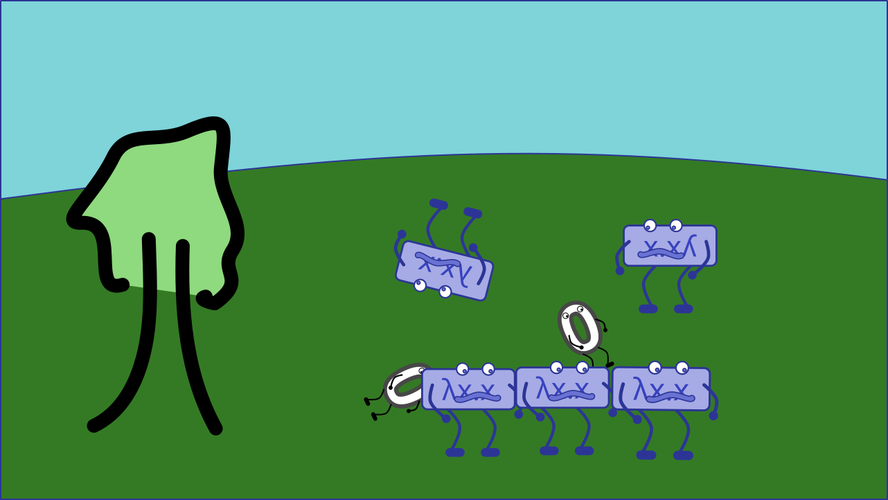
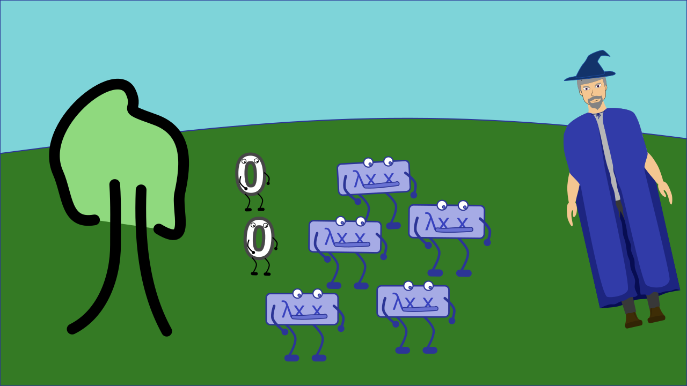

# Animatik

# Scena 1 - Uvod

# Scena 2 - Pojava mudraca

# Scena 3 - Stvaranje kombinatora

# Scena 4 - Predstavljanje kombinatora

_2/3 osnovna kombinatora se predstave, i prikaže se njihova funkcija_

PRIMJER:

**Kombinator Ida**: 
"Ja sam Ida! Ja uvijek vratim ono što dobijem."

_Broj 3 prolazi kroz Idu s lijeva i izlazi nepromjenjen s desna._

# Scena 5 - Mudrac vidi red

_Mudrac kima glavom._

**Mudrac**: 
"U redu. Sada je lagano odrediti tko gdje ide."

_Kombinatori se brzo poslože._

# Scena 6 - Red iz kaosa

_Prikaz sretnih brojeva kako prolaze kroz složeni izraz._

_Mudrac se nasmije._
